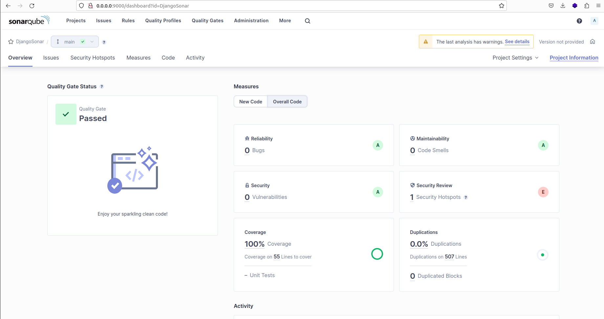

# Measure Django code quality using SonarQube, Pytest, and Coverage 

This guide shows how to check the quality of a Django code base making use of SonarQube, Pytest & Coverage.  

## Tools & Services:
- Django & DRF : for building the APIs
- Pytest: for writing & running automated tests
- Coverage: for measuring test coverage
- SonarQube : Static code analysis tool

## By the end of this tutorial 
- Build CRUD APIs using Django and DRF (Django Restframework)
- Write automated tests for the APIs using Pytest
- Measure code test coverage using Coverage
- Utilize SonarQube to assess code quality, identify code smells, security vulnerabilities, and more

# SonarQube analysis
